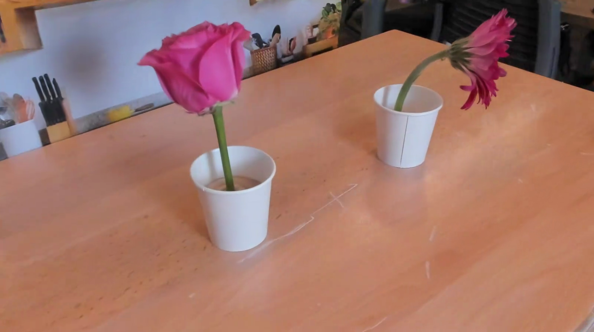
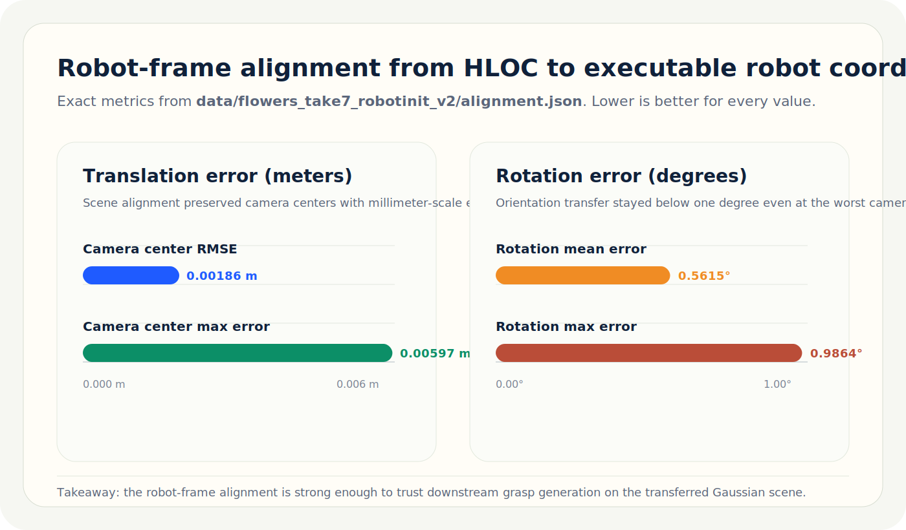
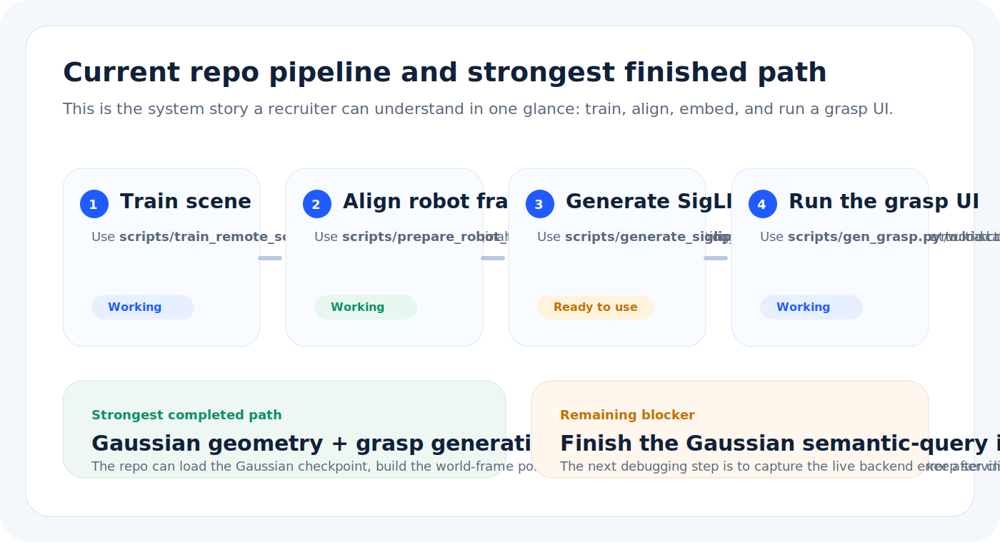
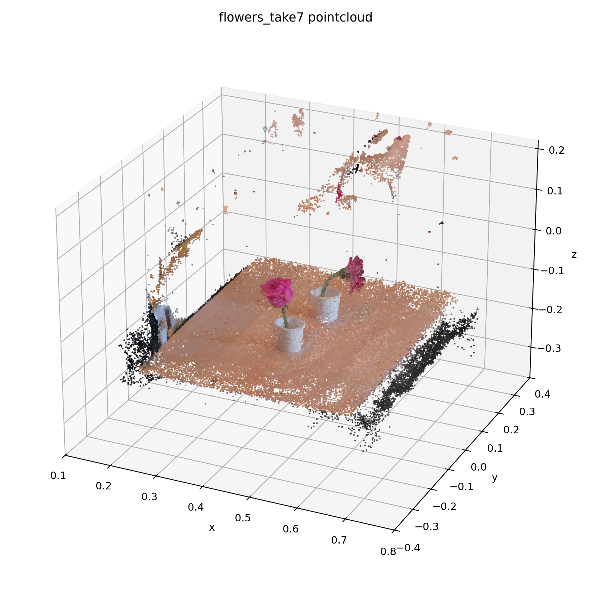

# Gaussian Task Grasping: Gaussian Splatting + SigLIP 2 for Task-Oriented Grasping

> Recruiter-friendly snapshot: this repo builds on the LERF-TOGO research direction with a Gaussian Splatting scene backend, robot-frame alignment tooling, and a working grasp-generation UI for semantic robotic manipulation.

[](docs/media/flowers_take7_hloc_v3_interp.mp4)

**Demo:** [Highest-quality HLOC Gaussian interpolation clip](docs/media/flowers_take7_hloc_v3_interp.mp4)
**Technical notes:** [handoff](HANDOFF_2026-04-17.md) · [architecture](SOL_CODEBASE_ARCHITECTURE.md) · [SOL training workflow](SOL_TRAINING.md)





## What This Repo Shows

- Gaussian Splatting scenes train and load through a shared scene backend abstraction in `robot_lerf/scene_backends.py`.
- HLOC/COLMAP reconstructions can be aligned back into the robot frame with `scripts/prepare_robot_frame_scene.py`.
- `scripts/gen_grasp.py` loads a trained scene, builds the world-frame point cloud, generates grasps, runs collision filtering, and serves a `viser` UI.
- SigLIP 2 multi-scale embeddings can be generated with `scripts/generate_siglip2_embeddings.py`.
- The strongest finished path today is Gaussian geometry plus grasp generation; the remaining blocker is the final Gaussian semantic-query integration pass.

## Engineering Contributions In This Snapshot

- Backend abstraction to support both the original LERF/Nerfstudio path and a Gaussian Splatting path from the same UI.
- Robot-frame alignment workflow for transferring high-quality SfM geometry back into executable robot coordinates.
- SigLIP 2 embedding worker and scene-query scaffolding for a newer semantic pipeline.
- SOL-ready training scripts and runbook documentation for remote CUDA training.
- Compatibility fixes across the viewer and vendored GraspNet/Dex-Net stack so the app boots and runs on current environments.

## Quick Launch

### 1. Install Nerfstudio first

Follow the official Nerfstudio setup until `tinycudann` is working:

- [Nerfstudio installation guide](https://docs.nerf.studio/en/latest/quickstart/installation.html)

### 2. Clone and install this repo

```bash
git clone https://github.com/milan-tiwari/gaussian-task-grasping.git
cd gaussian-task-grasping
python -m pip install -e .
```

### 3. Install the native GraspNet modules

```bash
cd robot_lerf/graspnet_baseline/knn
python setup.py install

cd ../pointnet2
python setup.py install

cd ../graspnetAPI
pip install -e .

cd ../../..
```

### 4. Optional: install SigLIP 2 dependencies

```bash
pip install pillow "transformers>=4.50.0" sentencepiece
```

Notes:

- SigLIP 2 support requires a newer `transformers` stack than many older Python 3.8 LERF environments provide.
- If your environment only resolves `transformers<=4.46.3`, use Python 3.9+ for the SigLIP 2 embedding step.

### 5. Generate SigLIP 2 embeddings for a scene

```bash
python scripts/generate_siglip2_embeddings.py \
  --scene-dir data/<scene_name> \
  --output-root outputs \
  --device cuda:0
```

This writes:

```text
outputs/<scene_name>/clip_siglip2_<model_slug>/
  level_0.npy
  level_0.info
  ...
```

### 6. Launch the interactive grasp UI

```bash
python scripts/gen_grasp.py \
  --config-path outputs/<scene_name>/<method>/<run_name>/config.yml \
  --scene-backend gaussian \
  --viser-port 8080
```

Then open `http://127.0.0.1:8080`.

Query format:

- `grasp` / `twist`: `object;part`
- `pick & place` / `pour`: `object;part;place`
- Example: `flower;petal`

## Important Runtime Notes

- Gaussian training is effectively CUDA-only in this Nerfstudio/Splatfacto setup.
- CPU-only Macs are fine for documentation, dataset prep, and baseline repo work, but not for realistic Gaussian training.
- The current Gaussian backend can load the checkpoint, build the point cloud, generate grasps, and serve the UI.
- The remaining unresolved piece is the end-to-end semantic query initialization path for the Gaussian backend.

## Key Files

| Goal | File |
| --- | --- |
| Launch or retrain remote scenes on SOL | `scripts/train_remote_scene.py` |
| Align an HLOC/SfM scene back into robot frame | `scripts/prepare_robot_frame_scene.py` |
| Generate SigLIP 2 pyramid embeddings | `scripts/generate_siglip2_embeddings.py` |
| Run the main grasp UI | `scripts/gen_grasp.py` |
| Shared scene backend abstraction | `robot_lerf/scene_backends.py` |
| Gaussian semantic query path | `robot_lerf/siglip_scene_query.py` |
| SOL setup guide | `SOL_TRAINING.md` |
| Status handoff | `HANDOFF_2026-04-17.md` |

## Expected Repo Layout

```text
lerf/
  data/
    <scene_name>/
      transforms.json
      images...
      depth...
  outputs/
    <scene_name>/
      clip_siglip2_<model_slug>/
      <method>/<run_name>/config.yml
  robot_lerf/
  scripts/
  HANDOFF_2026-04-17.md
  SOL_CODEBASE_ARCHITECTURE.md
  SOL_TRAINING.md
```

## SOL Usage

Train on SOL with a CUDA environment:

```bash
python scripts/train_remote_scene.py \
  --data data/flowers_take7 \
  --backend gaussian \
  --device cuda \
  --steps 30000 \
  --run-name flowers_gs_a100
```

If the remote `viser` app starts on port `8082`, tunnel it with:

```bash
ssh -N -J mtiwar26@sol.asu.edu -L 8082:127.0.0.1:8082 mtiwar26@sg236
```

## Citation

If this repo helps your work, please cite the original paper:

```bibtex
@inproceedings{lerftogo2023,
  title={Language Embedded Radiance Fields for Zero-Shot Task-Oriented Grasping},
  author={Adam Rashid and Satvik Sharma and Chung Min Kim and Justin Kerr and Lawrence Yunliang Chen and Angjoo Kanazawa and Ken Goldberg},
  booktitle={7th Annual Conference on Robot Learning},
  year={2023},
}
```
