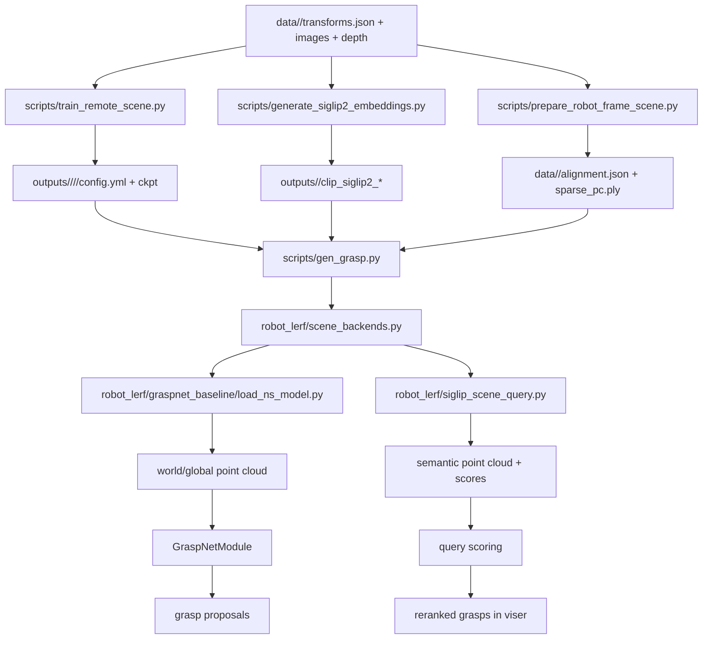

# SOL Codebase Architecture

This document explains how this repo is wired when running on SOL, with a focus on the current Gaussian + SigLIP 2 + grasp UI workflow.

If you want the current project status and outstanding issues, see [HANDOFF_2026-04-17.md](/Users/milantiwari/Desktop/lerf/HANDOFF_2026-04-17.md). This file is the more stable architecture note.

## 1. What lives where on SOL

Recommended checkout layout:

```text
/scratch/$USER/Lerf/
  data/
    flowers_take7/
    flowers_take7_hloc_v3/
    flowers_take7_robotinit_v2/
  outputs/
    flowers_take7/
    flowers_take7_hloc_v3/
    flowers_take7_robotinit_v2/
  robot_lerf/
  scripts/
  README.md
  SOL_TRAINING.md
```

The code assumes:

- datasets live under `data/<scene_name>/`
- trained Nerfstudio runs live under `outputs/<scene_name>/<method>/<run_name>/`
- semantic embedding artifacts live under `outputs/<scene_name>/clip_siglip2_*`

## 2. Environment split on SOL

In practice there are two useful Python environments:

### `nerfstudio`

Used for:

- scene training
- scene loading
- Gaussian point-cloud generation
- `gen_grasp.py`
- viewer / grasp UI

This is the environment that needs:

- Nerfstudio
- CUDA
- GraspNet native extensions
- repo package imports

### `siglip2`

Used for:

- SigLIP 2 tile embedding generation only

This environment exists because the older `nerfstudio` setup on SOL is often Python 3.8, while SigLIP 2 support in Hugging Face Transformers needs a newer Python/runtime combination.

This environment needs:

- Python 3.10+
- `torch`
- `transformers`
- `sentencepiece`
- `pillow`
- this repo on `PYTHONPATH`

## 3. The major runtime flows

There are four main flows:

1. scene training
2. scene alignment into robot/world frame
3. SigLIP 2 embedding generation
4. interactive grasp UI

### 3.1 Scene training

Entry point:

- [scripts/train_remote_scene.py](/Users/milantiwari/Desktop/lerf/scripts/train_remote_scene.py)

This script is the clean training launcher for SOL. It:

- takes `--data`, `--backend`, `--steps`, `--run-name`
- maps `gaussian` to Nerfstudio `splatfacto`
- maps `nerfstudio` / `lerf` to `lerf-lite`
- writes a portable `config.yml`
- resumes automatically from the latest checkpoint unless `--no-resume` is used

Output contract:

```text
outputs/<scene>/<method>/<run_name>/
  config.yml
  nerfstudio_models/step-*.ckpt
  dataparser_transforms.json
  tensorboard logs / events
```

Slurm wrapper:

- [scripts/train_scene.sbatch](/Users/milantiwari/Desktop/lerf/scripts/train_scene.sbatch)

That file is only a thin launcher around `train_remote_scene.py`.

### 3.2 Scene alignment into robot/world frame

Entry point:

- [scripts/prepare_robot_frame_scene.py](/Users/milantiwari/Desktop/lerf/scripts/prepare_robot_frame_scene.py)

Purpose:

- take an SfM/HLOC scene that reconstructs better
- align it to the original robot-frame dataset
- transfer the sparse point cloud into robot/world coordinates
- create a new retraining scene folder

Output contract:

```text
data/<output_scene>/
  transforms.json
  sparse_pc.ply
  alignment.json
  images...
  depth...
```

Important artifact:

- `alignment.json` stores the fitted similarity transform from SfM space into robot/world space

This file later gets reused by the live runtime to recover robot-frame coordinates when loading HLOC-style checkpoints.

### 3.3 SigLIP 2 embedding generation

Entry point:

- [scripts/generate_siglip2_embeddings.py](/Users/milantiwari/Desktop/lerf/scripts/generate_siglip2_embeddings.py)

Core worker files:

- [robot_lerf/clip_process.py](/Users/milantiwari/Desktop/lerf/robot_lerf/clip_process.py)
- [robot_lerf/siglip2_encoder.py](/Users/milantiwari/Desktop/lerf/robot_lerf/siglip2_encoder.py)

Purpose:

- load scene RGB images
- build a multi-scale tile pyramid
- encode tiles with SigLIP 2
- save embeddings in a format that the grasp UI can query later

Output contract:

```text
outputs/<scene_name>/clip_siglip2_<model_slug>/
  level_0.npy
  level_0.info
  ...
  level_6.npy
  level_6.info
```

The top-level scene output folder also gets a summary `.info` file.

### 3.4 Interactive grasp UI

Main entry point:

- [scripts/gen_grasp.py](/Users/milantiwari/Desktop/lerf/scripts/gen_grasp.py)

Purpose:

- load a trained scene model
- convert it to a world-frame point cloud
- generate grasps
- serve a `viser` UI
- optionally run semantic query scoring

This is the main “everything comes together here” file.

## 4. High-level wiring diagram



## 5. How the live runtime is wired

### 5.1 `gen_grasp.py` is the orchestration layer

Main responsibilities in [scripts/gen_grasp.py](/Users/milantiwari/Desktop/lerf/scripts/gen_grasp.py):

- set up `viser`
- load a scene backend through [scene_backends.py](/Users/milantiwari/Desktop/lerf/robot_lerf/scene_backends.py)
- build a point cloud
- initialize `GraspNetModule`
- cache or load `outputs/<scene>/grasps.npy`
- expose GUI controls for:
  - semantic query
  - grasp rescoring
  - scene load/train

Important runtime cache:

- [scripts/gen_grasp.py](/Users/milantiwari/Desktop/lerf/scripts/gen_grasp.py) saves grasps to `outputs/<scene_name>/grasps.npy`

That means the first run may be much slower than later runs on the same scene.

### 5.2 `scene_backends.py` is the abstraction boundary

File:

- [robot_lerf/scene_backends.py](/Users/milantiwari/Desktop/lerf/robot_lerf/scene_backends.py)

This file defines the stable interface used by the UI:

- `create_pointcloud()`
- `set_positives()`
- `get_lerf_pointcloud()`
- `visercam_to_model()`
- `semantic_queries_supported`

Concrete backends:

- `NerfstudioSceneBackend`
- `SplatfactoSceneBackend`

Why this matters:

- the grasp UI does not need to know whether the loaded model is old LERF or new Gaussian
- all backend-specific logic is pushed behind this adapter

### 5.3 `NerfstudioWrapper` is the geometry/runtime bridge

File:

- [robot_lerf/graspnet_baseline/load_ns_model.py](/Users/milantiwari/Desktop/lerf/robot_lerf/graspnet_baseline/load_ns_model.py)

This file does the real runtime-heavy lifting:

- loads Nerfstudio configs via `eval_setup(...)`
- exposes camera conversions
- resolves dataparser transforms
- discovers robot-frame alignment
- creates point clouds
- supports legacy LERF semantic rendering

Important detail:

- `NerfstudioWrapper` now looks for `alignment.json` automatically
- it also respects `ROBOT_LERF_ALIGNMENT_JSON` as an explicit override

That is how robot-frame Gaussian scenes can still be used after training or after transferring HLOC geometry back into robot coordinates.

### 5.4 Gaussian point-cloud creation is special

For Gaussian/Splatfacto, the stock Nerfstudio point-cloud exporter was not enough because of `FullImageDatamanager`.

The current code path in [load_ns_model.py](/Users/milantiwari/Desktop/lerf/robot_lerf/graspnet_baseline/load_ns_model.py):

- detects camera-based datamanagers
- renders each train camera directly
- reconstructs world points from `depth`
- subsamples and merges across views
- crops to the hardcoded table workspace

That path is what allowed `gen_grasp.py` to run on Gaussian checkpoints.

## 6. How the semantic query path is wired

### 6.1 Legacy naming vs current implementation

The UI still uses the older word “LERF” in labels and comments, but for the Gaussian backend the semantics are now handled by SigLIP 2.

So:

- UI text may say “LERF query”
- backend behavior may actually be SigLIP-based

### 6.2 Query engine entry

File:

- [robot_lerf/siglip_scene_query.py](/Users/milantiwari/Desktop/lerf/robot_lerf/siglip_scene_query.py)

This file:

- loads saved SigLIP tile embeddings
- loads `transforms.json`, images, and depth
- projects tile embeddings into 3D
- optionally loads DINO features
- binds semantic samples to the live reference point cloud
- returns semantic point clouds and relevancy scores back to `gen_grasp.py`

### 6.3 How it reconnects to the live Gaussian scene

The Gaussian backend path in [scene_backends.py](/Users/milantiwari/Desktop/lerf/robot_lerf/scene_backends.py):

1. constructs `SigLIPSceneQueryEngine`
2. loads the live geometry point cloud via `create_pointcloud()`
3. calls `set_reference_pointcloud(...)`

That reference binding step is important:

- the projected semantic points come from saved RGB/depth/embedding artifacts
- the live geometry point cloud comes from the loaded Gaussian checkpoint
- the query engine binds the two together so semantic scores can be mapped onto the current geometry

### 6.4 Scene aliasing and output discovery

The query engine is intentionally forgiving about scene naming.

It can discover semantics across names like:

- `flowers_take7`
- `flowers_take7_hloc_v3`
- `flowers_take7_robotinit_v2`

It does this by:

- inferring aliases from suffixes like `_robotinit_v2` and `_hloc_v3`
- reading `alignment.json`
- searching `outputs/<scene>/clip_siglip2_*`

This is why a robot-frame scene can still reuse embeddings generated under the original base scene name.

## 7. Query syntax in the UI

This is a very important runtime detail.

The query box in [scripts/gen_grasp.py](/Users/milantiwari/Desktop/lerf/scripts/gen_grasp.py) is not free-form natural language. It expects semicolon-separated fields.

### For `grasp` and `twist`

- `object;part`
- example: `flower;petal`
- example: `cup;rim`

### For `pick & place` and `pour`

- `object;part;place`
- example: `flower;petal;table`

If the wrong number of fields is supplied, the UI rejects the query before the semantic backend runs.

## 8. Grasp generation path

The grasping path is still built around the vendored GraspNet baseline under [robot_lerf/graspnet_baseline](/Users/milantiwari/Desktop/lerf/robot_lerf/graspnet_baseline).

Key pieces:

- [robot_lerf/graspnet_baseline/graspnet_module.py](/Users/milantiwari/Desktop/lerf/robot_lerf/graspnet_baseline/graspnet_module.py)
- [robot_lerf/graspnet_baseline/load_ns_model.py](/Users/milantiwari/Desktop/lerf/robot_lerf/graspnet_baseline/load_ns_model.py)
- [robot_lerf/grasp_planner_cmk.py](/Users/milantiwari/Desktop/lerf/robot_lerf/grasp_planner_cmk.py)

Flow:

1. scene point cloud is created
2. hemisphere cameras are generated
3. GraspNet predicts grasps from cropped views
4. grasps are transformed back to world frame
5. collision detection filters them
6. semantic query later reranks them

## 9. Files that matter most on SOL

If someone is debugging the current stack on SOL, these are the highest-value files:

### Entry points

- [scripts/train_remote_scene.py](/Users/milantiwari/Desktop/lerf/scripts/train_remote_scene.py)
- [scripts/prepare_robot_frame_scene.py](/Users/milantiwari/Desktop/lerf/scripts/prepare_robot_frame_scene.py)
- [scripts/generate_siglip2_embeddings.py](/Users/milantiwari/Desktop/lerf/scripts/generate_siglip2_embeddings.py)
- [scripts/gen_grasp.py](/Users/milantiwari/Desktop/lerf/scripts/gen_grasp.py)

### Runtime adapters

- [robot_lerf/scene_backends.py](/Users/milantiwari/Desktop/lerf/robot_lerf/scene_backends.py)
- [robot_lerf/graspnet_baseline/load_ns_model.py](/Users/milantiwari/Desktop/lerf/robot_lerf/graspnet_baseline/load_ns_model.py)

### Semantic stack

- [robot_lerf/clip_process.py](/Users/milantiwari/Desktop/lerf/robot_lerf/clip_process.py)
- [robot_lerf/siglip2_encoder.py](/Users/milantiwari/Desktop/lerf/robot_lerf/siglip2_encoder.py)
- [robot_lerf/siglip_scene_query.py](/Users/milantiwari/Desktop/lerf/robot_lerf/siglip_scene_query.py)

### Deployment / workflow notes

- [SOL_TRAINING.md](/Users/milantiwari/Desktop/lerf/SOL_TRAINING.md)
- [HANDOFF_2026-04-17.md](/Users/milantiwari/Desktop/lerf/HANDOFF_2026-04-17.md)

## 10. Non-repo SOL patches to remember

Not everything lives in this repo.

The HLOC reconstruction path also depended on SOL-side changes:

- a local `~/Hierarchical-Localization` checkout
- patches for `pycolmap 3.12.5`
- a helper `~/bin/colmap` script for Nerfstudio’s install checks

So if the SOL environment is rebuilt from scratch, those changes must be recreated separately.

## 11. Practical troubleshooting map

### If training fails

Check:

- [scripts/train_remote_scene.py](/Users/milantiwari/Desktop/lerf/scripts/train_remote_scene.py)
- [scripts/train_scene.sbatch](/Users/milantiwari/Desktop/lerf/scripts/train_scene.sbatch)
- the `config.yml` inside the run folder

### If robot-frame loading crops to zero points

Check:

- `alignment.json`
- `ROBOT_LERF_ALIGNMENT_JSON`
- [robot_lerf/graspnet_baseline/load_ns_model.py](/Users/milantiwari/Desktop/lerf/robot_lerf/graspnet_baseline/load_ns_model.py)

### If semantic query fails

Check:

- query format first
- `outputs/<scene>/clip_siglip2_*`
- [robot_lerf/siglip_scene_query.py](/Users/milantiwari/Desktop/lerf/robot_lerf/siglip_scene_query.py)
- [robot_lerf/scene_backends.py](/Users/milantiwari/Desktop/lerf/robot_lerf/scene_backends.py)

### If the browser UI loads but grasps do not

Check:

- whether `outputs/<scene>/grasps.npy` exists
- GraspNet native extensions under `knn` and `pointnet2`
- [scripts/gen_grasp.py](/Users/milantiwari/Desktop/lerf/scripts/gen_grasp.py)

## 12. Bottom line

The repo is currently wired around a clear division of responsibilities:

- `scripts/` contains the human-facing entrypoints
- `scene_backends.py` hides backend differences from the UI
- `load_ns_model.py` bridges Nerfstudio models into robot/world-space geometry
- `siglip_scene_query.py` bridges saved semantic embeddings back onto live Gaussian geometry
- `gen_grasp.py` is the top-level application that combines geometry, semantics, grasps, and the viewer

That is the core mental model for understanding the SOL codebase.
